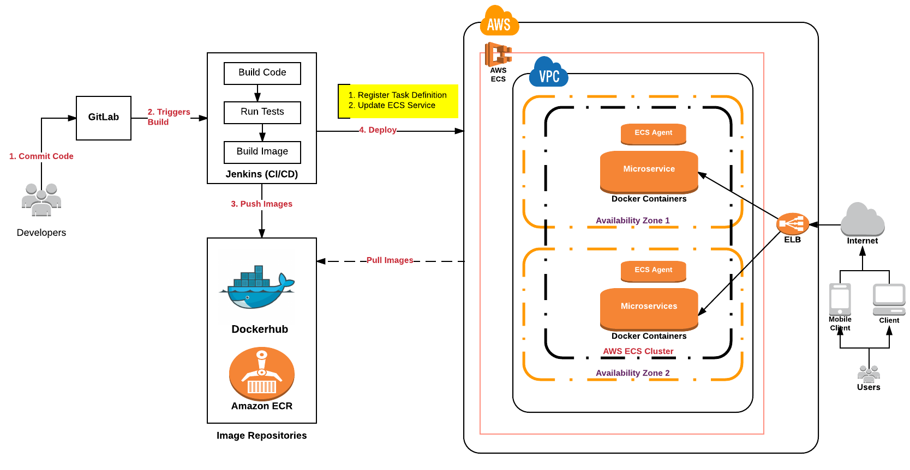

# Deep Dive into Continuous Delivery of Microservices on AWS

The goal of this project is to enable developers play with continuous delivery of microservices on [Awazon Web Services (AWS)](https://aws.amazon.com/). Those planning to do **startups** could get tips and code aamples to get started with development, testing and releasing (continuously deploying) the software thereby gaining the competitive edge for their products.

The project would demonstrate some of the following:

 1. Developers check-in the code into the code repository such as GitLab. 
 2. GitLab webhook triggers the Jenkins job 
 3. Jenkins job starts with getting code from repository, build the code, run the unit tests/integration 
 4. Once build and tests run successfully, Jenkins build the image for microservices and push the same to either of Dockerhub or [AWS ECR (EC2 Container Registry)](https://aws.amazon.com/ecr/).
 5. After the docker image for microservices is pushed to the image repository, following is done to deploy microservices (would run within containers) on [AWS EC2 Container Service (ECS) Cluster](http://docs.aws.amazon.com/AmazonECS/latest/developerguide/ECS_clusters.html) or [AWS Elastic Beanstalk (EB)](http://docs.aws.amazon.com/elasticbeanstalk/latest/dg/Welcome.html).
    - **AWS ECS Cluster**: For deploying to ECS cluster, a new task definition is registered and the ECS service is updated. As a result of updating ECS service, the container using microservices image (pulled from image repository) gets started.
    - **AWS Elastic Beanstalk**: For deploying the microservices on AWS EB, the execution of EB Cli command related with deployment is executed which leads to starting of container (with microservice image) on EC2 instance on AWS EB environment.


This project is intended to provide information related with some of the following topics.
```
1. Setup Gitlab and Jenkins (relevant plugins)
2. Setup Dockerhub, AWS ECR
3. Continuous Delivery using AWS ECS 
4. Continuous Delivery using AWS Elastic Beanstalk 
5. Configure Jenkins post-steps for deployment to AWS ECS and AWS Elastic Beanstalk
```
## Setup Gitlab and Jenkins

The first step is to get setup with the development envitonment. We shall use Docker images for GitLab and Jenkins and, Docker-compose for starting/commissioning the environment. Once environment is commissioned, it would be required to login into both GitLab and Jenkins to do some of the following:

1. **GitLab**: Ceate code repository

2. **Jenkins**:Install plugins,configure system, create job, configure job  etc.  

Read further details on this page, [Jenkins Gitlab with Docker Containers](https://github.com/eajitesh/Continuous-Delivery-Microservices-AWS/blob/master/jenkins-gitlab-setup.md)

## Setup Dockerhub and AWS account    

Next step is to create your account with image repository such as Dockerhub and AWS ECR. 

1. **Dockerhub**: Go to [Dockerhub](http://www.dockerhub.com) and get signed up. You will be using this credentials from within Jenkins to login to Dockerhub and push the images.
2. **AWS**: Go to [AWS](http://www.aws.com) and get signed up. 

## Continuous Delivery of Microservices on AWS using AWS ECS

[AWS EC2 Container Service (ECS)](http://docs.aws.amazon.com/AmazonECS/latest/developerguide/Welcome.html) is a highly scalable container management service which is used to start, stop and run microservices within Docker containers on AWS EC2 instances. In this project, it is demonstrated as to how to deploy container-based microservices using CLI commands from within Jenkins. As part of getting setup with ECS, following needs to be done:

 1. Create a repository (EC2 Repository - ECR)
 2. Create a task definition 
 3. Create an ECS cluster
 4. Create a service

Following represents the **solution architecture** of deploying microservices on AWS using AWS ECS.



Read further details on this page, [Continuous Delivery of Microservices with AWS ECS](https://github.com/eajitesh/Continuous-Delivery-Microservices-AWS/blob/master/aws-ecs-setup.md)

## Continuous Delivery of Microservices on AWS using AWS Elastic Beanstalk

[AWS Elastic Beanstalk](https://aws.amazon.com/documentation/elastic-beanstalk/) service is used to deploy and scale web applications and services developed with Java, .NET, PHP, Nodejs, Python, Ruby, Go and Docker on servers such as Apache, Tomcat, Nginx etc. All one is required to do is simply upload their code and Elastic Beanstalk does some of the following aspect of deployment:

 - Capacity provisioning
 - Load balancing
 - Auto-scaling
 - Application-health monitoring

Following represents the **solution architecture** of deploying microservices on AWS using AWS Elastic Beanstalk.


Read further details on this page, [Continuous delivery of Microservices on AWS using AWS Elastic Beanstalk](https://github.com/eajitesh/Continuous-Delivery-Microservices-AWS/blob/master/aws-eb-setup.md)

