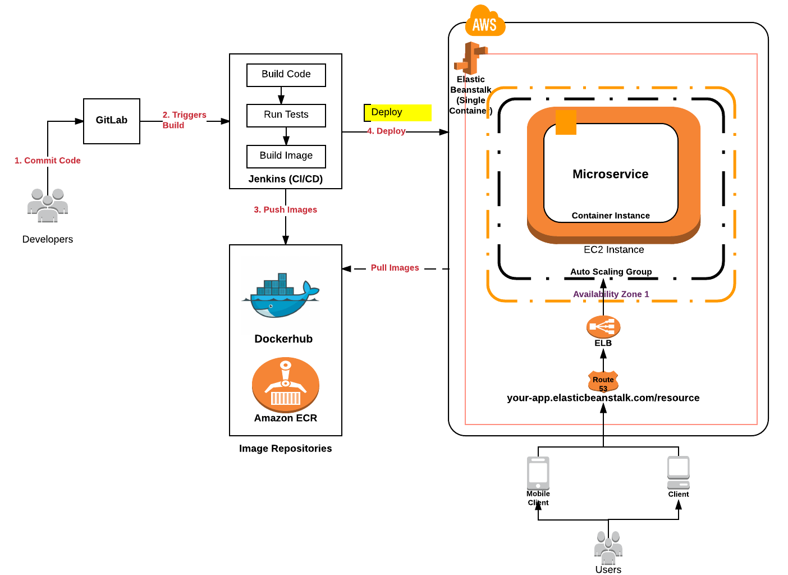

## Continuous Delivery of Microservices on AWS using AWS Elastic Beanstalk

[AWS Elastic Beanstalk](https://aws.amazon.com/documentation/elastic-beanstalk/) service is used to deploy and scale web applications and services developed with Java, .NET, PHP, Nodejs, Python, Ruby, Go and Docker on servers such as Apache, Tomcat, Nginx etc. All one is required to do is simply upload their code and Elastic Beanstalk service takes care of different aspects of deployment such as capacity provisioning, load balancing, auto-scaling, application/service health monitoring etc.

## Solution Architecture

Following represents the **solution architecture** of deploying microservices on AWS using AWS Elastic Beanstalk.

In the above diagram, pay attention to some of the following:

 1. Code is checked into code repository such as Gitlab
 2. Webhook configured in GitLab triggers the Jenkins job
 3. Jenkins job starts executing which results in following steps:
    - Retrieve the microservice artifacts from Gitlab
    - Build the microservice
    - Run the tests such as unit and integration tests
    - Build the image if all of the above steps are successful
    - Push the image to image repository such as Dockerhub or AWS ECR
    - Deploy using AWS Elastic Beanstalk CLI command 

